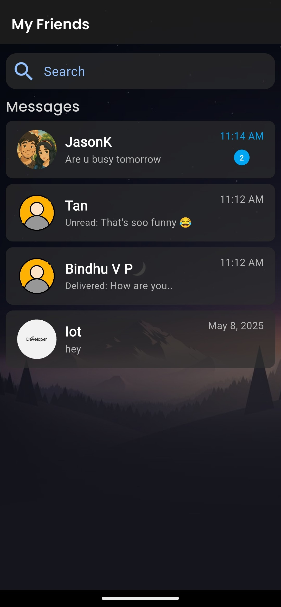

A modern, responsive website designed to showcase the **MyFriends** chat application — styled like the Play Store. It includes app details, latest updates, screenshots, version history with download links, and usage instructions.

## 📱 About MyFriends App

**MyFriends** is a secure one-on-one chat app built with privacy in mind. It supports:

* ✅ End-to-end encrypted messages
* ✅ Instant notifications
* ✅ Message deletion
* ✅ Text remention for clarity
* ❌ No group chats or file sharing (yet — coming soon!)

## 🌐 Website Features

* 🔹 App Icon, Name & Developer Details
* 🔹 "What's New" Section for latest release notes
* 🔹 Download links for all previous versions
* 🔹 App Screenshots
* 🔹 Usage Manual for new users
* 🔹 Clean and modern responsive layout

## 📸 Screenshot Preview



## 🚀 Live Preview

You can host it locally or deploy to GitHub Pages, Netlify, or any static hosting service.

## 📁 Project Structure

```bash
├── Apps/                       # APK files (all versions)
├── ScreenShots/               # App screenshots
├── style.css                  # Main stylesheet
├── index.html                 # Main HTML page
└── Icon.png                   # App icon
```

## 🔧 How to Use

1. Clone the repository
   `git clone https://github.com/yourusername/app-showcasing-website.git`

2. Open `index.html` in your browser
   *or* deploy it to a live static host.

## 📜 License

This project is open source under the [MIT License](LICENSE).

---

Would you like me to also generate the `LICENSE` file or a live preview deployment guide (e.g., GitHub Pages)?
